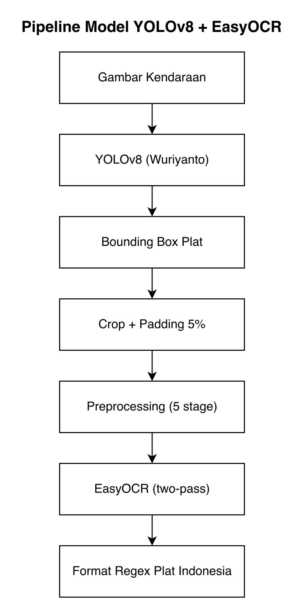
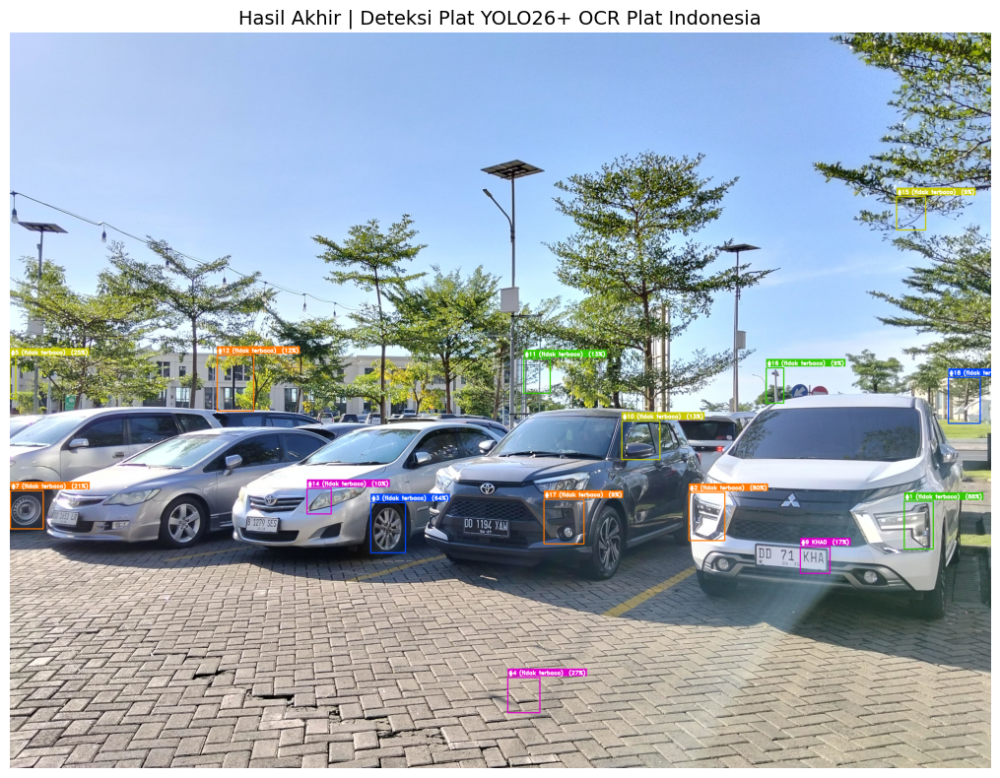
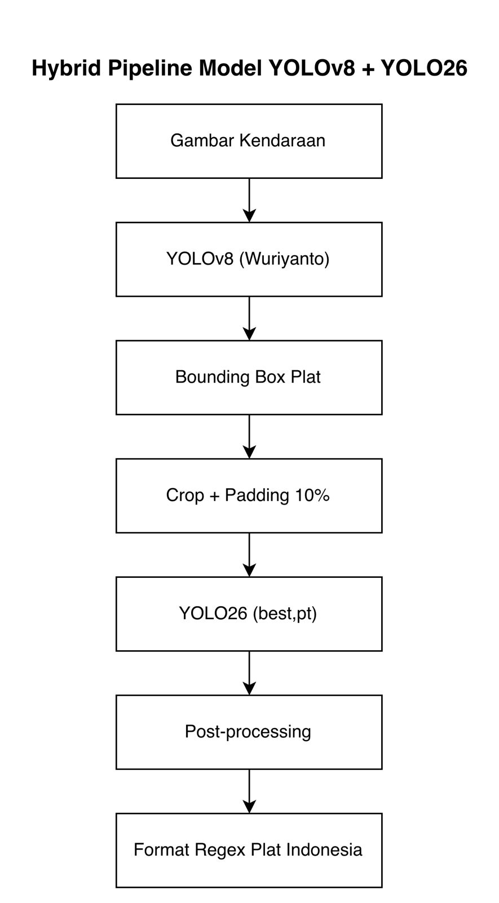
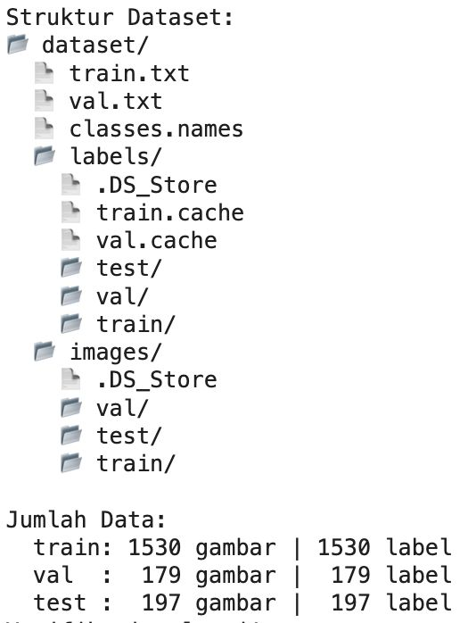

# Comparative Study of YOLOv8+EasyOCR, YOLO26-Only, and Hybrid YOLOv8+YOLO26 for Indonesian License Plate Recognition

A computer vision research project that trains a custom YOLO26 character recognition model and compares three pipeline architectures for reading Indonesian license plates. The central finding is that task separation between plate location detection and character recognition is the critical design decision in building a reliable LPR system.

---

## Overview

License Plate Recognition (LPR) for Indonesian vehicles presents unique challenges: plates come in multiple formats (white background with black text for private vehicles, black background with white text for older plates), varying lighting conditions, and varying distances from the camera.

This project explores three pipeline architectures:

1. **YOLOv8 + EasyOCR**: Uses a pretrained YOLOv8 model from Hugging Face for plate location detection, followed by a 5-stage preprocessing pipeline and EasyOCR for character reading.
2. **YOLO26-Only**: Uses a custom-trained YOLO26 model directly for detection without a dedicated plate locator. This pipeline was intentionally tested to document its failure mode.
3. **Hybrid YOLOv8 + YOLO26**: Combines YOLOv8 (Wuriyanto) for plate location with the custom-trained YOLO26 model for per-character detection, with manual NMS, size filtering, and row-grouping post-processing.

---

## Pipelines Compared

### Pipeline 1: YOLOv8 + EasyOCR

<div align="center">

</div>

| Stage | Detail |
|---|---|
| Plate detection | YOLOv8 pretrained (`wuriyanto/yolo8-indonesian-license-plate-detection`) |
| Config | conf=0.08, iou=0.45, imgsz=1920 |
| Crop + padding | Adaptive padding 5% per side |
| Upscaling | 2x cubic interpolation |
| Preprocessing | Grayscale, CLAHE (clipLimit=3.0), sharpening kernel 3x3, Otsu thresholding, crop 15% bottom |
| OCR | EasyOCR with two-pass strategy (invert on empty result) |
| Output | Regex-formatted Indonesian plate string |

### Pipeline 2: YOLO26-Only (Documented Failure)

This pipeline attempted to replace YOLOv8 with the custom YOLO26 model directly. Because YOLO26 was trained to detect 36 individual characters (not a plate as a whole object), it produced 12 chaotic bounding boxes on an image containing only 4 vehicles, with 0 out of 12 crops returning readable output.

<div align="center">

</div>

### Pipeline 3: Hybrid YOLOv8 + YOLO26

<div align="center">

</div>

| Stage | Detail |
|---|---|
| Plate detection | YOLOv8 pretrained (`wuriyanto/yolo8-indonesian-license-plate-detection`) |
| Config | conf=0.10, iou=0.45, imgsz=1920 |
| Crop + padding | Adaptive padding 10%, minimum 320x160px after upscale |
| Character detection | YOLO26 custom model (`best.pt`), conf=0.30, iou=0.35, imgsz=640 |
| Post-processing | Manual NMS (IoU threshold 0.30), size filtering (30% of avg), row grouping (ROW_TOLERANCE=40px), left-to-right sort |
| Output | Regex-formatted Indonesian plate string |

---

## Dataset

**Source:** [Indonesian License Plate Recognition Dataset](https://www.kaggle.com/datasets/juanthomaswijaya/indonesian-license-plate-dataset) (Kaggle)  
**Additional access:** [Google Drive](https://drive.google.com/drive/folders/1dSfeRFhcaQ0Z2WG26rw8aajEqnWRLtVu?usp=sharing)

| Split | Images | Labels |
|---|---|---|
| Train | 1,531 | 1,531 |
| Validation | 179 | 179 |
| Test | 197 | 197 |
| **Total** | **1,909** | **1,909** |

- **Format:** YOLO annotation format (.txt per image)
- **Classes:** 36 alphanumeric characters (digits 0-9 and uppercase letters A-Z)
- **Total validation instances:** 1,321 character annotations across 179 images
- **Class with most instances:** `1` (170 instances in validation)
- **Class with fewest instances:** `Q` (10 instances in validation)

<div align="center">

</div>

---

## Model Training

**Base model:** `yolo26s.pt` (pretrained on COCO, 80 classes)
**Target:** Fine-tuned to 36 alphanumeric character classes
**Transfer rate:** 696 of 708 weight items transferred (98.3%)
**Environment:** Google Colab, NVIDIA Tesla T4 (14.6 GB VRAM)

| Hyperparameter | Value |
|---|---|
| Epochs (planned) | 100 |
| Early stopping patience | 20 |
| Actual epochs (stopped) | 39 (best at epoch 19) |
| Batch size | 16 |
| Image size | 640x640 px |
| Optimizer | AdamW (auto-selected) |
| Learning rate | 0.00025 |
| Momentum | 0.9 |
| GPU memory used | 4.96 GB / 14.9 GB |
| Training duration | 0.707 hours (~42 minutes) |
| Speed | ~2.5 iterations/sec, ~40 sec/epoch |

**Augmentations applied:** Mosaic, horizontal flip (fliplr=0.5), HSV color jitter (hsv_h=0.015, hsv_s=0.7, hsv_v=0.4), Albumentations (Blur, MedianBlur, ToGray, CLAHE)

### Training Results

| Metric | Value |
|---|---|
| mAP@50 | 96.73% |
| mAP@50-95 | 71.12% |
| Precision | 94.18% |
| Recall | 92.26% |

**Best performing classes (mAP@50 above 99%):** `1`, `3`, `4`, `5`, `6`, `Z`, `K`, `V`

**Weakest performing classes:** `Q` (72.2%), `G` (86.2%), `O` (89.3%), `T` (90.1%)

---

## Results

**Test image:** Real parking lot photo, 4096x3072px, containing 4 vehicles.

**Plates in image:** DD 71 KHA, DD 1194 XAW, B 1279 SES, DD 1651 LR

**YOLOv8 detection confidence per plate:** 84.98%, 73.19%, 48.45%, 14.54%

### Pipeline 1: YOLOv8 + EasyOCR

| Plate | Ground Truth | EasyOCR Output | Correct Chars | Accuracy |
|---|---|---|---|---|
| #1 | DD 71 KHA | DD 71 KHA | 8/8 | 100% |
| #2 | DD 1194 XAW | DD 1197 XAM | 7/9 | 77.8% |
| #3 | B 1279 SES | 279SES | 6/8 | 75.0% |
| #4 | DD 1651 LR | DD 1651 LR | 8/8 | 100% |
| **Total** | | | **29/33** | **87.9%** |

**Full plates read correctly:** 2/4 (50%)

### Pipeline 2: YOLO26-Only

| Metric | Value |
|---|---|
| Plates detected | 12 bounding boxes (expected: 4) |
| Plates readable | 0/4 |
| Character accuracy | 0% |

All bounding boxes pointed to individual characters scattered across vehicle bodies, not plate regions. Every crop fed to EasyOCR returned empty output.

### Pipeline 3: Hybrid YOLOv8 + YOLO26

| Plate | Ground Truth | YOLO26 Output | Correct Chars | Accuracy |
|---|---|---|---|---|
| #1 | DD 71 KHA | DD 1 KHA | 6/7 | 85.7% |
| #2 | DD 1194 XAW | D 1194 XAW | 9/10 | 90.0% |
| #3 | B 1279 SES | B 1279 SES | 8/8 | 100% |
| #4 | DD 1651 LR | O 1651 R | 5/9 | 55.6% |
| **Total** | | | **28/34** | **82.4%** |

**Full plates read correctly:** 1/4 (25%)

### Summary Comparison

| Metric | YOLOv8 + EasyOCR | Hybrid YOLOv8 + YOLO26 | YOLO26-Only |
|---|---|---|---|
| Full plates correct | 2/4 (50%) | 1/4 (25%) | 0/4 (0%) |
| Character accuracy | 29/33 (87.9%) | 28/34 (82.4%) | 0% |
| Plates detected | 4/4 (100%) | 4/4 (100%) | 12 (all wrong) |
| Inference speed | ~33.3 ms/image | ~300 ms/image | N/A |

---

## Key Findings

**Finding 1: A character recognition model cannot substitute for a plate detector.** YOLO26 trained on 36 character classes has no concept of a plate as a whole object. Plugging it directly into a plate detection pipeline produces completely wrong bounding boxes, making all downstream processing fail. The task of locating a plate and the task of reading its characters require separate models with separate training objectives.

**Finding 2: YOLOv8 + EasyOCR outperformed the hybrid pipeline in this test.** Despite YOLO26 achieving 96.7% mAP@50 on the validation set, the end-to-end character accuracy of the hybrid pipeline (82.4%) fell below EasyOCR (87.9%). EasyOCR benefits from whole-word context when reading, while YOLO26 treats each character independently with no surrounding context.

**Finding 3: YOLOv8 detection confidence directly determines downstream reading quality.** Plates detected with confidence above 70% were read accurately by both pipelines. The plate detected at 14.54% confidence caused the worst failure in the hybrid pipeline, where `DD` was misread as `O` and `L` was missed entirely due to poor crop quality.

**Finding 4: The hybrid architecture is more extensible despite lower accuracy.** Every stage in the hybrid pipeline can be debugged, replaced, or improved independently. The character-level bounding boxes also provide richer output than a plain OCR string, which is useful for downstream validation logic.

---

## Project Structure

**Notebooks (Google Colab)**

```
YOLOv8_Indonesia_License_Plate_Recognition.ipynb
      Pipeline 1: YOLOv8 pretrained + EasyOCR

Training_ModelYOLO26_Indonesian_Plate_Recognition.ipynb
      Training YOLO26s on 36-class character dataset

YOLO26_Indonesia_License_Plate_Recognition.ipynb
      Pipeline 2: YOLO26-only (documented failure)

HybridPipeline_YOLOv8_YOLO26_Indonesian_Plate_Recognition.ipynb
      Pipeline 3: Hybrid YOLOv8 + YOLO26
```

**Google Drive (`Indonesian_Plate_Recognition/`)**

```
Indonesian_Plate_Recognition/
├── dataset/                  (Kaggle dataset: 1,909 images, YOLO format)
├── hasil_inferensi/          (Inference output images saved per run)
├── trained_models/           (Saved model checkpoints from training)
├── modelv8.pt                (YOLOv8 pretrained, from Hugging Face Wuriyanto, 6 MB)
└── parkiran.jpeg             (Test image used for all pipeline comparisons, 1.5 MB)
```

---

## Requirements

```
Python 3.12+
ultralytics==8.4.46
torch==2.10.0+cu128
easyocr
opencv-python
numpy
Pillow
```

Install dependencies:

```bash
pip install ultralytics easyocr opencv-python numpy Pillow
```

---

## How to Run

All notebooks are designed to run on Google Colab with Google Drive mounted.

**Step 1:** Upload the dataset to Google Drive at:
```
/MyDrive/Indonesian_Plate_Recognition/dataset/
```

**Step 2:** Upload or place model weights at:
```
/MyDrive/Indonesian_Plate_Recognition/trained_models/
```

**Step 3:** Open the desired notebook in Google Colab and run all cells in order.

To train the YOLO26 model from scratch, run notebook `2_Training_ModelYOLO26`. The resulting `best.pt` will be saved to your Drive automatically and can be used directly in notebooks 3 and 4.

---

## Author

**Chaiden Richardo Foanto**
Informatics, Universitas Ciputra Makassar
crichardo01@student.ciputra.ac.id
chaiden.foanto@gmail.com
